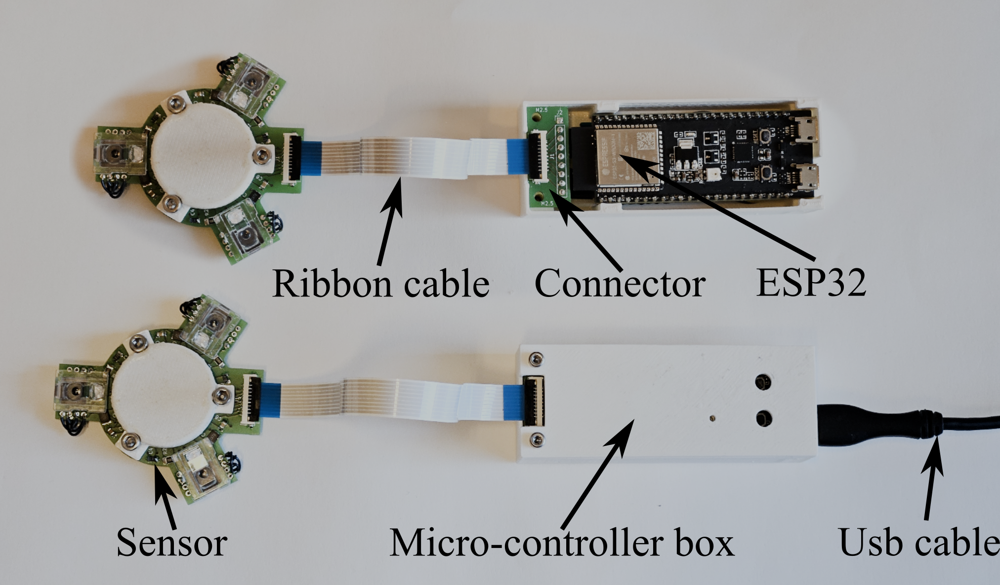
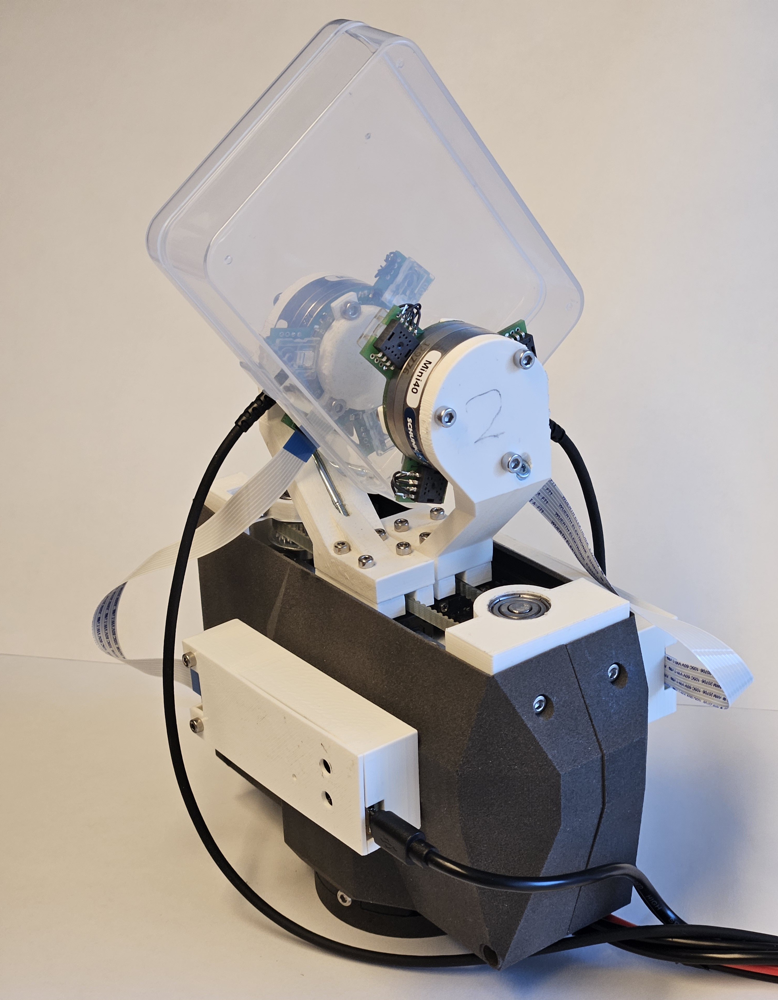

# Velocity sensor 

This is a build guide for the velocity sensor used in the paper "Perception, Control and Hardware for In-Hand Slip-Aware Object Manipulation with Parallel Grippers", preprint available at: https://arxiv.org/abs/2410.19660. Everything is provided as is. 

The main repo for that project can be found at https://github.com/Gabrieleenx/Slip-Aware-Object-Manipulation-with-Parallel-Grippers 

This readme contains the following:
* Overview
* Overview of code
* Parts list
* Build guide

## Overview 

This repo is about the velocity sensors that are mounted on the figers of the gripper described in https://github.com/Gabrieleenx/Slip-Aware-Object-Manipulation-with-Parallel-Grippers. I have plans to redesign these sensors, the current version funciton and does what they where built to do, but there are some properties I would like to improve. The sensors can be seen bellow:

These senors are mounted on the gripper like following:

The sensor can meassure velocity in x, y and rotation for a flat surface sliding in the gripper. Currently I have the sensor output velocity measurements at 120 Hz. And they have simple outlier rejection, where if one sensor is outside of the object, the tracking still functions. 

## Overview of code

The code can be found in the folder /code. The code is compiled using platfromIO, see the platformio.ini for the settings. 

One important thing is to set the "sensor_name = "sensor_2";" variable on line 16 in main.cpp, to either "sensor_1" or "sensor_2" depending on which finger it goes on, you can make up your own names aswell. 

The code to communicate with the sensors can be found at  https://github.com/Gabrieleenx/Slip-Aware-Object-Manipulation-with-Parallel-Grippers.

The code uses freeRTOS, built into the Arduio framework, one core is tasked with bitbanging the sensors and the other is doing filtering and serial communication. Here we use the ESP32-S3-DEVKITC-1-N8R2, whcih has the UART to USB, in comparion to the gripper, https://github.com/Gabrieleenx/Parallel_gripper. 

## Parts list

This part list is for one sensor:

1x ESP32-S3-DEVKITC-1-N8R2 https://www.digikey.se/sv/products/detail/espressif-systems/ESP32-S3-DEVKITC-1-N8R2/15199627?utm_adgroup=&utm_source=google&utm_medium=cpc&utm_campaign=PMAX%20Shopping_Product_High%20Performers&utm_term=&productid=15199627&utm_content=&utm_id=go_cmp-19549529751_adg-_ad-__dev-c_ext-_prd-15199627_sig-Cj0KCQjw6auyBhDzARIsALIo6v9aY2U1Z_6ftd6Mk9g_03A8pc_SY02bz6c1suR7hCspnPgnHgATvJgaAj-cEALw_wcB&gad_source=1&gclid=Cj0KCQjw6auyBhDzARIsALIo6v9aY2U1Z_6ftd6Mk9g_03A8pc_SY02bz6c1suR7hCspnPgnHgATvJgaAj-cEALw_wcB

3x rapoo m300 (we will take the chip, lens and LED) https://www.rapoo-eu.com/product/m300-silent/

3x 50 ohm resisor https://se.rs-online.com/web/p/surface-mount-resistors/2430511?searchId=c8ebc58c-fdc6-42fc-99b9-0c60799ca582&gb=s

1x hrough Hole Pin Header https://se.rs-online.com/web/p/pcb-headers/7671025?searchId=941cb68f-9620-4753-9d9d-7a9d76368953&gb=s

2x Molex, Easy-On, 200528 1mm Pitch 9, https://se.rs-online.com/web/p/fpc-connectors/1213341?searchId=74c22de1-7fd5-41bc-b195-446cd1a22052&gb=s

1x FFC Ribbon Cable, 9-Way, 1mm Pitch, 152mm, https://se.rs-online.com/web/p/ribbon-cable/1222519?searchId=01f7c47b-5acd-4eca-bbf9-52f6bdeb05a2&gb=s 

3x 10μF Tantalum Capacitor 16V dc, https://se.rs-online.com/web/p/tantalum-capacitors/1882267?searchId=6749729e-8b06-4c40-b989-853f3fd36829&gb=s

3x 1μF Tantalum Capacitor 16V dc, https://se.rs-online.com/web/p/tantalum-capacitors/1882297?searchId=ff8f216c-4b23-46ba-a96b-6da0473a7bb6&gb=s

3x 100nF Multilayer Ceramic Capacitor MLCC, https://se.rs-online.com/web/p/mlccs-multilayer-ceramic-capacitors/2644416?searchId=eb5cf758-94db-469c-92b0-0f58a4a6b858&gb=s

1x USB cable, with micro usb

dupont cables

2x m2.5 20mm screw and nut to mount the lid

2x m2.5 srew and nut to mount the microcontroller box, length depends on

3x m3 screw, to mount the sensor, length depends on

## PCB boards
* Sensor board 2 layer, see gerber files (traces have been updated, jumper wires no longer needed)
* Connector board 2 layer, see gerber files 

## 3D print

The controleller box is printed in 2 pices, bottom and top, both in PLA. The contact pad stl can be found at https://github.com/Gabrieleenx/Parallel_gripper. Otherwise see stl_files.

## Build guide
